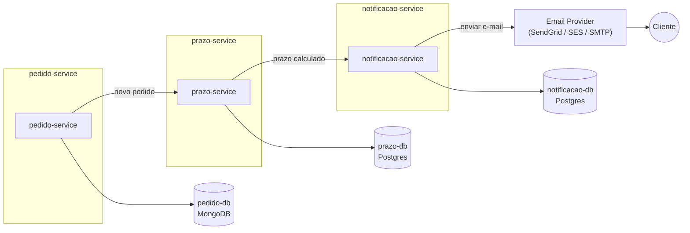

# Distributed Logistics System - Notificacao Service

Distributed Logistics System
Objetivo

Simular um sistema distribuído de logística com microservices, filas e streaming de eventos, focando em resiliência e integração de bancos diferentes.

Tecnologias

Java 21+, Spring Boot 3+

Kafka ou RabbitMQ

MongoDB + PostgreSQL

Docker Compose

Testcontainers para testes automatizados

Arquitetura e Microservices

3️⃣ Notificações Service

Função: Recebe eventos de prazo calculado e envia alertas para clientes.
Processamento:

Consumidor Kafka/RabbitMQ escuta eventos de cálculo de prazo

Envia notificações (simulado com logs ou prints)

Pode ter fila de retry para falhas de envio

Banco: MongoDB ou PostgreSQL opcional para histórico de notificações

Funcionalidades

Processamento assíncrono e resiliente de pedidos

Comunicação entre microservices via eventos

Retry patterns e monitoramento de falhas

Testes automatizados e integração com bancos distintos

